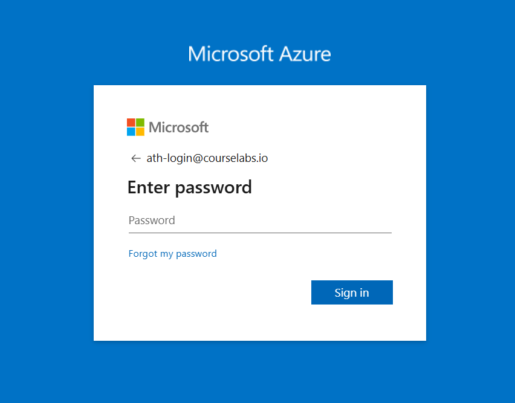
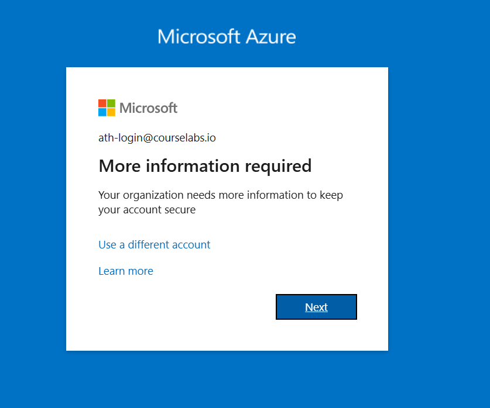
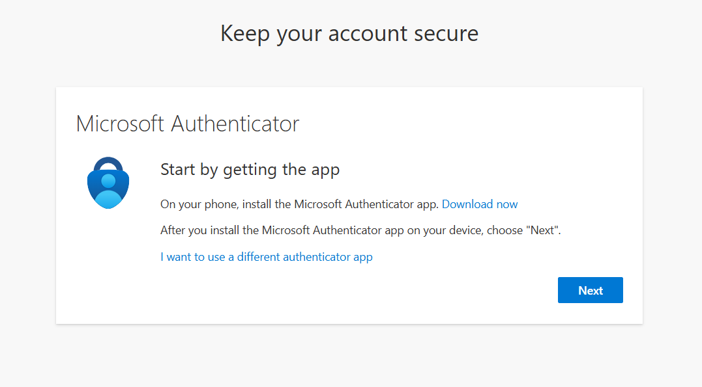
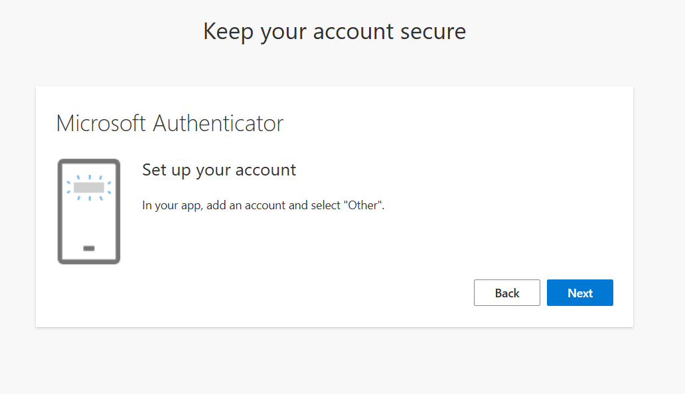
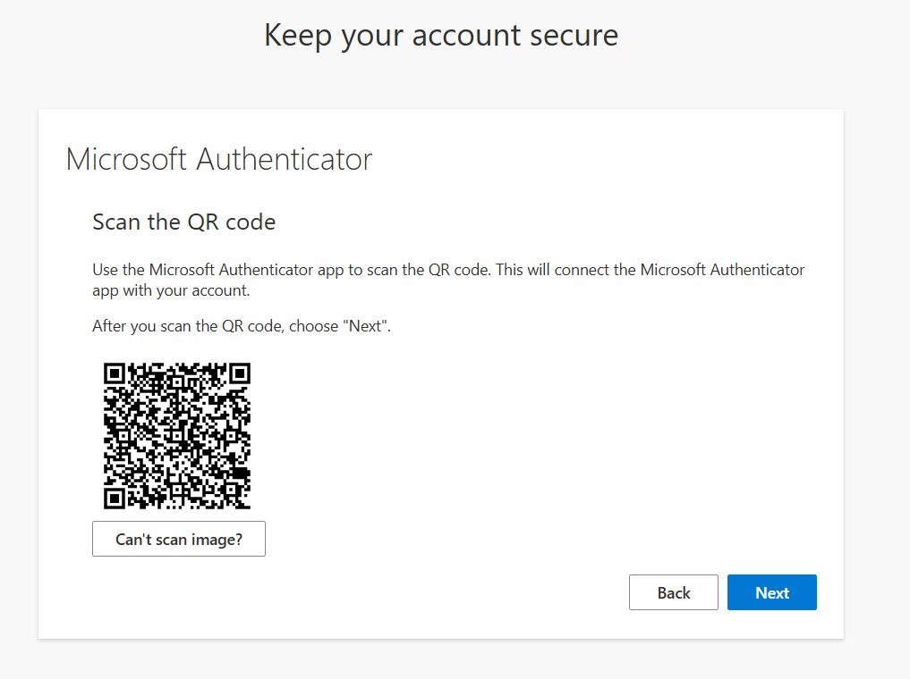
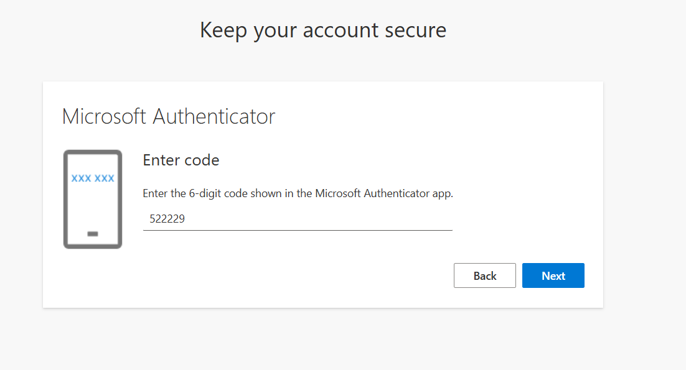
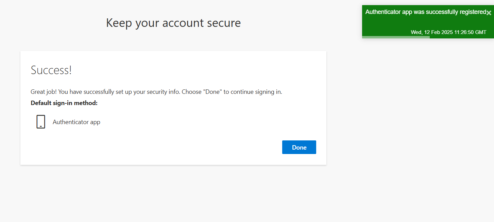

### Azure Portal Login Steps

Following are Azure Portal login steps; follow these steps to login into Azure Portal.

#### Azure Portal Login Details:  

Sign-in URL: https://portal.azure.com/

**Email**: `Will be provided by Instructor`

**Password**: `Will be provided by Instructor`

**Important:** Incase of this screen, click **"Next"** button:

**NOTE:**  PLEASE DOWNLOAD "MICROSOFT AUTHENTICATOR APP AND FOLLOW INSTRUCTIONS TO ENABLE MFA"

**NOTE:** Scan QR code before clicking **Next**.

After login, enter the same URL in the browser to view the virtual machines:

`https://portal.azure.com/#browse/Microsoft.Compute%2FVirtualMachines`

