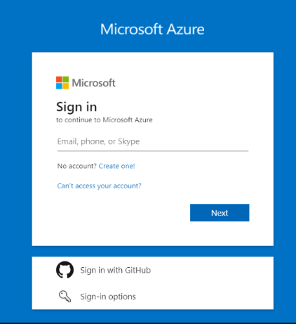
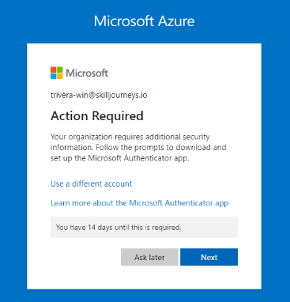
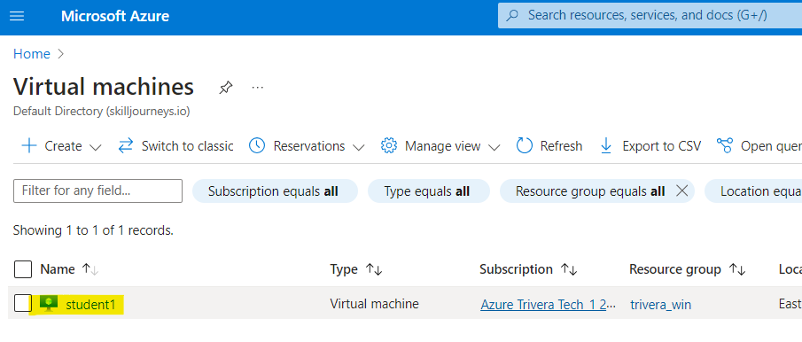
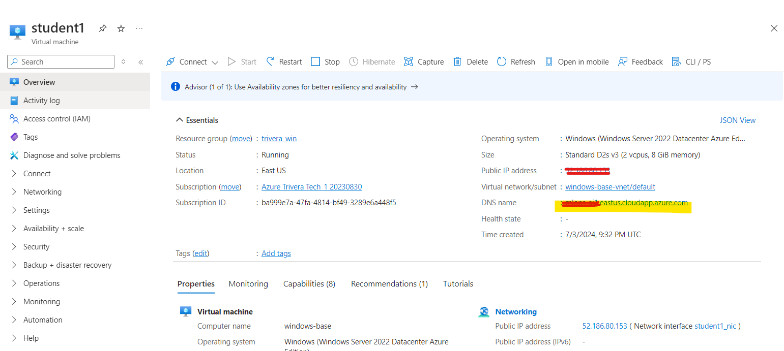
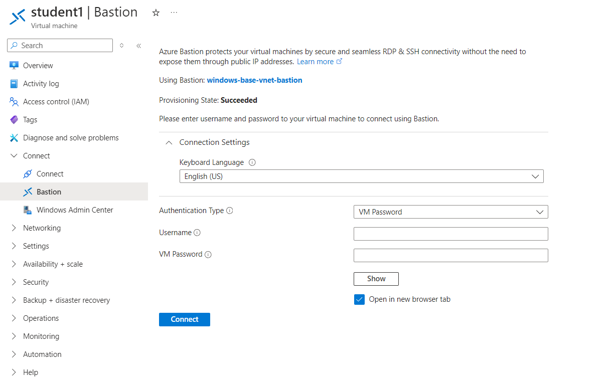

### Lab Environment Login Steps

Following are Azure Portal login steps; follow these steps to login into Azure Portal and then connect with lab environments using RDP client.

#### Azure Portal Login Details:  

Sign-in URL: https://portal.azure.com/#view/HubsExtension/BrowseResource/resourceType/Microsoft.Compute%2FVirtualMachines

**Email**: `Will be provided by Instructor`

**Password**: `Will be provided by Instructor`

**Important:** Incase of this screen, click **"Ask Later"** button:

**NOTE:**  PLEASE DO NOT CLICK "NEXT" and DO NOT DOWNLOAD "MICROSOFT AUTHENTICATOR APP"

After login, enter the same URL in the browser to view the virtual machines:

`https://portal.azure.com/#browse/Microsoft.Compute%2FVirtualMachines`

Please refer to this instruction for accessing lab environment:

#### Connect using RDP Client

Click VM **assigned** to you to get the detail to connect using RDP client:

Copt `DNS name` and connect with virtual machine using RDP client:

**Username:** `Will be provided by Instructor`

**Password:** `Will be provided by Instructor`

#### Connect using RDP Browser

If you don't have access to RDP client, you can connect using Azure Bastion Browser. Click `Connect` > `Bastion`.

**Note:** Windows Desktop will open in new browser.
